## Тема ВКР: "Геоинформационная система литературного картирования произведений русской литературы"
---
#### Содержание
Введение
1.	Анализ предметной области
1.1.	Методы и модели компьютерной лингвистики
1.2.	Инструменты компьютерной лингвистики
1.3.	Особенности работы с картографическими приложениями
2.	Разработка технического задания
3.	Разработка проектных решений по ГИС и её частям
3.1.	Архитектура веб-приложения
3.2.	Интерфейс
3.3.	База данных
3.4.	Алгоритм анализа произведения
3.5.	Выбор средств реализации
4.	Разработка ГИС
4.1.	Разработка ГИС
4.2.	Тестирование ГИС
5.	Разработка документации по ГИС и её частям

Заключение
Список используемой литературы

---
### Введение
Литературная карта произведения – это картографическое изображение модели художественного пространства, созданного автором в художественном произведении, творчески переработанное редактором или издателем, исходя из текста и замысла произведения [5]. Она может быть полезна во многих областях: 
1.	в образовании: играя в качестве инструмента для визуальной интерпретации произведения, литературные карты могут способствовать вовлеченности школьников и студентов в процесс изучения художественного текста и облегчению его восприятия; 
2.	в туризме: создание имиджа территории, на которой разворачивается сюжет книги, а также карта может выполнять функцию путеводителя; 
3.	в маркетинге: карта может выступать в качестве продвижения художественного издания.

Однако создание литературной карты – это процесс, требующий времени (от пары часов до нескольких дней, в зависимости от объема текста), выделенного на анализ произведения, а в последующем - на визуализацию. Создание приложения, способного автоматически построить маршрут героев книги с помощью анализа оцифрованного текста (с условием, что места, описанные в произведении, взяты с реальной карты мира), поможет ускорить и упростить этот процесс. Любой человек сможет загрузить интересующий его текст и ознакомиться с передвижениями героев произведения.
**Объектом исследования ВКР** выступает процесс анализа оцифрованного художественного произведения и визуализации полученных из него данных в формате маршрута на географической карте.
**Предметами исследования ВКР** являются модели и алгоритмы анализа художественных произведений, методы визуализации.
**Целью выпускной квалификационной работы** является автоматизация построения маршрутов героев книги с помощью морфологического анализа художественного произведения с использованием методов корпусной лингвистики и векторизации текста.
Для достижения поставленной цели необходимо решить следующие задачи: 
1.	произвести анализ методов, моделей и инструментов компьютерной лингвистики;
2.	описать требования к геоинформационной системе, разработать техническое задание на создание геоинформационной системы;
3.	разработать проектные решения по геоинформационной системе и её частям;
4.	разработать геоинформационную систему и провести тестирование;
5.	разработать документацию на геоинформационную систему и её частям.
---
### 1. Анализ предметной области
---
### 2. Разработка технического задания
Разработка технического задания идет по ГОСТ 34.602-84

#### Техническое задание
#### 1.	Общие сведения
##### 1.1.	Полное наименование системы и её условное обозначение
«Геоинформационная система литературного картирования произведений русской литературы на примере романа Л.Н. Толстого “Война и мир”»

##### 1.2.	Шифр темы или шифр (номер) договора
***шифр темы или шифр (номер) договора***

##### 1.3.	Наименование предприятий (объединений) разработчика и заказчика (пользователя) системы и их реквизиты
Заказчик: кафедра Информационных технологий и автоматизированных систем, Пермский национальный исследовательский университет
Разработчик: студент группы РИС-19-1б Люкина Диана Сергеевна

##### 1.4.	Перечень документов, на основании которых создается система, кем и когда утверждены эти документы
 «Анализ текста: составление карты литературного произведения» Д.С. Курушин, Е.В. Гребенщикова, Е.Д. Орлова, П.Ю. Фоминых, Пермский национальный исследовательский политехнический университет

##### 1.5.	Плановые сроки начала, и окончания работы по созданию системы
Срок начала работы по созданию системы: 06.02.2023 г.
Срок окончания работы: 02.06.2023 г.

##### 1.6.	Сведения об источниках и порядке финансирования работ
Собственные средства разработчика

##### 1.7.	Порядок оформления и предъявления заказчику результатов работ по созданию системы (ее частей), по изготовлению и наладке отдельных средств (технических, программных, информационных) и программно-технических (программно-методических) комплексов системы
Результаты работ передаются заказчику частями по завершении каждой её стадии.
В качестве результатов работ разработчика выступают программный код и документация на автоматизированную систему, которые передаются заказчику в виде репозитория с кодом программы на github и докуменов в электронном виде в формате .docx соответственно.
 
#### 2.	Назначение и цели создания (развития) системы
##### 2.1.	Назначение системы
Геоинформационная система литературного картирования произведений русской литературы предназначена для автоматизации построения маршрутов героев книги с помощью анализа оцифрованного художественного произведения

##### 2.2.	Цели создания системы
Основными целями создания системы являются:
-	популяризация русской литературы;
-	развитие интереса людей к чтению;
-	формирование имиджа территорий, на которых разворачиваются сюжеты книг, что способствует культурному туризму.

#### 3.	Характеристика объектов автоматизации
##### 3.1.	Kраткие сведения об объекте автоматизации или ссылки на документы, содержащие такую информацию
Объектами автоматизации выступает процесс анализа оцифрованного художественного произведения и визуализация полученных из него данных в формате маршрута на географической карте.
На серверной части должен быть реализован алгоритм анализа произведений, расположенные в базе данных, который находит в тексте действующих лиц и их местоположение (оно должно быть действительным в жизни, чтобы можно было разместить данные на реальную карту) и заносит эти данные в базу данных соответственно с обработанной книгой. Также должно быть реализовано взаимодействие с базой данных для получения списка литературы.
Клиентская часть должна быть реализована в виде веб-приложения, запускаемого в браузере. Оно состоит из вступительной страницы с кратким описанием системы и участниками работы над ней и из основной, представленной в виде интерактивной карты реального мира. На основной и происходят все главные события.
Веб-приложение должно предоставлять следующие возможности:
1.	выбор из списка литературы одного произведения (Рис. 1)
2.	выбор героев из книги, маршрут которых пользователю хотелось бы увидеть на карте (Рис. 1)

 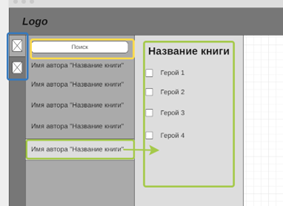 
Рис. 1 – прототип интерфейса пользовательского меню

3.	загрузка своего произведения в систему из компьютера
 
 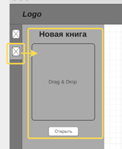 
Рис. 2 – прототип интерфейса для загрузки произведения

4.	взаимодействие с картой:
-	изменение масштаба
-	измерение расстояния маршрута
-	поиск расположения пользователя на карте
-	поделиться маршрутом в соц. сетях
-	распечатать карту

##### 3.2.	Cведения об условиях эксплуатации объекта автоматизации и характеристиках окружающей среды
Функционирование системы должно быть непрерывным в течении всего срока эксплуатации.

#### 4.	Требования к системе
##### 4.1.	Требования к системе в целом
Система должна удовлетворять следующим требованиям:
-	исполнение всех функций, оговоренных настоящим документом в пункте 4.2;
-	исполнение требований к веб-приложению, оговоренных настоящим документов в пунктах 4.1.1., 4.1.2., 4.1.3., 4.1.4., 4.1.5., 4.1.6., 4.1.7., 4.1.8., 4.1.9., 4.1.10., 4.1.11., 4.1.12., 4.1.13.

###### 4.1.1.	Требования к структуре и функционированию системы
Клиент-серверная архитектура. На клиенте должен быть организован интерфейс, с помощью которого пользователь будет взаимодействовать с приложением. Сервер должен обрабатывать запросы пользователя, проводить анализ загруженных текстов в систему, взаимодействовать с базой данных. База данных должна содержать данные, которые получились в результате работы алгоритма на сервере.

###### 4.1.2.	Требования к численности и квалификации персонала системы и режиму его работы
Требования не предъявляются

###### 4.1.3.	Показатели назначения
###### 4.1.3.1.	Степень приспособляемости системы к изменению процессов и методов управления, к отклонениям параметров объекта управления
Система не должна препятствовать появлению новых или изменению текущих процессов и методов управления.
###### 4.1.3.2.	Допустимые пределы модернизации и развития системы
Модернизация и развитие системы прекращается в случае, когда экономические затраты на их внедрение превышают затраты, вложенные на указанные цели.

###### 4.1.4.	Требования к надежности
Пользователю, работающему с программой через веб-браузер, должен быть предоставлен непрерывный доступ к веб-приложению, расположенному по определенному url-адресу. Система должна быть устойчивой, другими словами, она должна обладать способностью соответствующим образом реагировать на аварийные ситуации.
###### 4.1.5.	Требования безопасности
Не предъявляются
###### 4.1.6.	Требования к эргономике и технической эстетике
Веб-приложение должно быть оснащено графическим интерфейсом для обеспечения связи между ним и пользователем, которое позволит достигать поставленных веб-приложением целей.

###### 4.1.7.	Требования к транспортабельности для подвижных АС
Требования не предъявляются

###### 4.1.8.	Требования к эксплуатации, техническому обслуживанию, ремонту и хранению компонентов системы
Требования не предъявляются
###### 4.1.9.	Требования к защите информации от несанкционированного доступа
Требования не предъявляются

###### 4.1.10.	Требования по сохранности информации при авариях требования к защите от влияния внешних воздействии
Требования не предъявляются 

###### 4.1.11.	Требования к патентной чистоте
Требования к патентной частоте должны быть соблюдены системой согласно действующему законодательству Российской Федерации.

###### 4.1.12.	Требования по стандартизации и унификации
Требования по стандартизации и унификации не требуются
###### 4.1.13.	Дополнительные требования
Дополнительные требования не предъявляются

###### 4.2.	Требования к функциям(задачам), выполняемым системой
Веб-приложение должно предоставлять следующие возможности:
1.	Выбор из списка литературы одного произведения
2.	Выбор героев из книги, маршрут которых пользователю хотелось бы увидеть на карте
3.	Загрузка своего произведения в систему из компьютера. 
Разрешенные расширения загружаемых в систему файлов: .txt, .doc, .docx, .pdf
4.	Взаимодействие с картой:
-	изменение масштаба
-	измерение расстояния маршрута
-	поиск расположения пользователя на карте
-	поделиться маршрутом в соц. сетях
-	распечатать карту

##### 4.3.	Требования к видам обеспечения
###### 4.3.1.	Требования к математическому обеспечению системы
Обработка произведений должна осуществляться с помощью морфологического анализа с применением методов корпусной лингвистики и векторизации текста.
###### 4.3.2.	Требования к информационному обеспечению
Требования не предъявляются
###### 4.3.3.	Требования к лингвистическому обеспечению
Система будет использовать русский язык для взаимодействия с пользователем.
При разработке системы должны использоваться следующие языки:
-	HTML, CSS – frontend часть веб-приложения
-	Python, Flask, JavaScript, React – frontend и backend части веб-приложения
-	SQL – взаимодействие с данными 

###### 4.3.4.	Требования к программному обеспечению
Система должна поддерживаться во всех современных браузерах кроме тех, в которых отсутствует поддержка ES5-методов или микротасков, например Internet Explorer, потому что в данной системе будет использоваться React.

###### 4.3.5.	Требования к техническому обеспечению
Техническое обеспечение системы должно максимально и наиболее эффективным образом использовать существующие технические средства.
###### 4.3.6.	Требования к метрологическому обеспечению
Требования не предъявляются
###### 4.3.7.	Требования к организационному обеспечению
Требования не предъявляются
###### 4.3.8.	Требованию к методическому обеспечению САПР
Требования не предъявляются

#### 5.	Состав и содержание работ по созданию системы
|Наименование этапа	|Дата выполнения|
|-------------------|---------------|
|Обследование (сбор и анализ данных) автоматизируемого объекта, включая сбор сведений о зарубежных и отечественных аналогах	|28.02.23|
|Разработка технического задания на ГИС в целом и, при необходимости, частных ТЗ на подсистемы ГИС	|21.03.23|
|Разработка теоретической части, методики решения; Выбор и разработка средств решения задачи	|02.05.23|
|Разработка документации к программному продукту	|16.05.23|
|Представление работы на проверку и отзыв руководителя квалификационной работы	| 19.05.23|

#### 6.	Порядок контроля и приемки системы
##### 6.1.	Виды, состав, объем и методы испытаний системы и ее составных частей
Испытание системы проводится с помощью функционального тестирования
##### 6.2.	Общие требования к приемке работ по стадиям (перечень участвующих предприятий и организаций, место и сроки проведения), порядок согласования и утверждения приемочной документации
Сдача-приемка работ осуществляется по предъявлении разработчиком отчетов по ВКР и других сопроводительных комплектов документов. 

#### 7.	Требования к составу и содержанию работ по подготовке объекта автоматизации к вводу системы в действие 
##### 7.1.	Приведение поступающей в систему информации (в соответствии с требованиями к информационному и лингвистическому обеспечению) к виду, пригодному для обработки с помощью ЭВМ
Осуществляется в процессе разработки веб-приложения с использованием языков программирования, оговоренные настоящим техническим заданием
##### 7.2.	Изменения, которые необходимо осуществить в объекте автоматизации
Приложение находится на этапе разработки первой версии.
##### 7.3.	Создание условий функционирования объекта автоматизации, при которых гарантируется соответствие создаваемой системы требованиям, содержащимся в ТЗ
Не предъявляются.
##### 7.4.	Создание необходимых для функционирования системы подразделений и служб
Создание необходимых для функционирования системы подразделений и служб не требуется.
##### 7.5.	Сроки и порядок комплектования штатов и обучения персонала
В этом нет необходимости.

#### 8.	Требования к документированию

#### 9.	Источники разработки
Источниками разработки настоящего технического задания выступают:
-	ГОСТ 34.602-89.
---

### 3.	Разработка проектных решений по ГИС и её частям
Проектирование ГИС перед разработкой веб-приложения является критически важным шагом. Правильное выполнение этого этапа позволяет создать более эффективное и масштабируемое веб-приложение, которое легче поддерживать и сопровождать в долгосрочной перспективе. Проектирование системы дает возможность разработчику и заказчику получить визуальное представление о проекте и отделить имеющиеся идеи от тех, которых нет. Проитерировав и определив ключевые требования приложения, можно шаг за шагом представить концепцию будущего веб-приложения и уточнить решения по его разработке.
#### 3.1.	Архитектура веб-приложения
ГИС литературного картирования имеет клиент-серверную архитектуру. Такую архитектуру часто используют для построения веб-приложений. И не без причины. У неё есть ряд преимуществ: 
1.	Клиент-серверная архитектура обеспечивает более эффективную обработку запросов и расчетов. Она позволяет распределить нагрузку между клиентским и серверным оборудованием, что повышает их производительность.
2.	Централизованный контроль является ключевым преимуществом клиент-серверной архитектуры. Сервер предоставляет централизованный доступ к всем ресурсам, что позволяет эффективно управлять ресурсами приложения и обеспечивает более безопасную обработку данных.
3.	Клиент-серверная архитектура обеспечивает более удобный и простой доступ к ресурсам приложения. Она позволяет пользователям получать доступ к приложению из любого места в мире через интернет. Это позволяет пользователю быстро и легко получить необходимую информацию.
Подробнее рассмотрим архитектуру, на основе которой будет строиться ГИС литературного картирования произведений русской литературы (Рис. 3).
 
 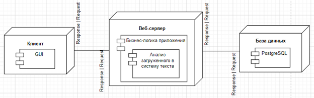 
Рис.3 – клиент-серверная архитектура ГИС

Система многоуровневая. Каждый слой выполняет определенную функцию. 
Клиентом выступает браузер. Когда пользователь вводит URL-адрес, он отправляет запрос на сервер для получения нужной страницы. Браузер получает ответ от сервера и выводит его на экране. Положительным ответом будет являться интерфейс (GUI), который отображает всю информацию и обеспечивает взаимодействие с пользователем (карта и меню с выбором произведений и персонажей и с загрузкой текста). 
Сервер выполняет функцию обработки запросов клиента, хранения и обновления данных, а также передачи их на клиентскую сторону. Функция выполнения бизнес-логики на сервере обеспечивание обработку данных, а точнее анализ загруженного пользователем текста и сохранение полученных результатов в базе данных. =
Клиент и сервер взаимодействуют друг с другом с помощью протоколов и сетевых соединений. При работе веб-приложения запросы и ответы осуществляются путем их передачи в сети с использованием протокола HTTP. Протокол HTTP устанавливает набор правил и процедур, которые используются веб-клиентами и веб-серверами для обмена сообщениями друг с другом (запросы и ответы).
База данных хранит данные, которые получились в результате работы анализа алгоритма, выполняющегося на сервере. 
#### 3.2.	Выбор средств реализации приложения
Основой любой ГИС является карта. Работа ВКР построена вокруг OpenStreetMap. Он предоставляет открытую базу данных расположения объектов, включая дороги, здания, мосты и многие другие элементы, что обеспечивает возможность создавать интерактивные карты, основанные на реальных данных. OpenStreetMap предоставляет документацию со всеми её компонентами, которые помогают в разработке приложений с картами (Рис. 4) [6].

 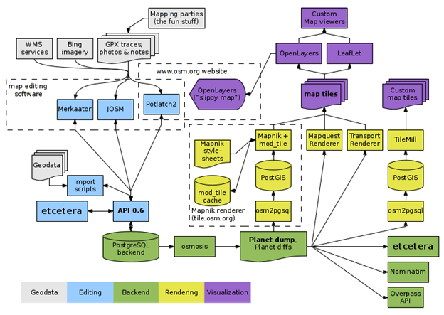 
Рис. 4 – компоненты OpenStreetMap

Для разработки взяты компоненты Nominatim и Leaflet. Nominatim предназначен для осуществления поиска географических объектов по их имени и адресу. С помощью него получаем координаты полученных из анализа произведения населенных пунктов, а Leaflet отображает эти координаты, соединяя их в линии, представляющие маршруты героев произведения, на карте OpenStreetMap.
Формирование интерфейса и взаимодействие с картой выполняет React. Это библиотека JavaScript, которая позволяет обновлять элементы на странице без её перезагрузки при том, что встроенный алгоритм согласования отслеживает, какие части приложения изменились и обновить только их, а не полностью все приложение. 
React Leaflet обеспечивает привязки между React и Leaflet. Она не заменяет Leaflet, но использует ее для абстрактных слоев Leaflet в качестве компонентов React.
CSS – язык каскадных стилей, который используется для описания внешнего вида страницы. С помощью CSS можно задавать различные стили для разных элементов HTML, таких как цвет, фон, шрифт, выравнивание и многое другое. В случае React используется не HTML, а помесь между HTML и JavaScript, называемым JSX.
Flask — это микро-фреймворк для создания веб-приложений на Python. Расширения для микро-фреймворка позволяют коммуницировать с базами данных, проверять формы, контролировать загрузку на сервер, работать с аутентификацией и многое другое. Flask использует одну из самых передовых служебных библиотек WSGI (Web Server Gateway Interface), используется для пересылки запросов с веб-сервера (такого как Apache или Nginx) на серверное веб-приложение или фреймворк Python. Затем ответы передаются обратно на веб-сервер для ответа отправителю запроса (Рис. 5).

 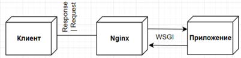 
Рис.5 – работа WSGI

Контейнер WSGI – это в целом отдельный запущенный процесс, который выполняется на другом порту, чем веб-сервер, и веб-сервер настроен на передачу запросов в контейнер WSGI, который запускает веб-приложение, а затем передает ответ (в виде HTML) обратно отправителю запроса в браузере.
В ГИС данной ВКР с помощью Flask осуществляем взаимодействие веб-приложения с базой данных и анализ загруженного текста в систему.
Nginx, упомянутый на рис. 5, выступает в качестве веб-сервера, который используется для обработки запросов пользователей и управления их распределением между различными серверами веб-приложений. Вместо создания новых процессов для каждого веб-запроса, Nginx использует асинхронный, управляемый событиями подход. В этом случае запросы обрабатываются в одном потоке. Более того, один главный процесс может управлять различными рабочими процессами в нем.
Для хранения данных используется PostgreSQL (Postgres) – объектно-реляционная система управления базами данных (СУБД), которая используется для организации хранения и управления большими объемами структурированных данных. PostgreSQL предоставляет расширенные функциональные возможности, включая поддержку индексов, транзакций, хранимых процедур и триггеров, а также обработку данных географических информационных систем (ГИС).
В итоге из всех вышеперечисленных инструментов строится ГИС литературного картирования произведений русской литературы.

#### 3.3.	Диаграммы последовательности
Диаграммы последовательности помогают документировать и понимать динамические аспекты программной системы - в частности, последовательность сообщений, которые отправляются и принимаются между объектами. На рис. 6 изображена диаграмма последовательности для прецедента просмотра маршрутов. На ней описано следующее: 
Чтобы получить данные конкретного персонажа, пользователь, обращаясь к интерфейсу ГИС, производит запрос выбора книги из списка. Сервер обрабатывает этот запрос и формирует другой, уже к базе данных, на получение информации о героях и об их маршрутах выбранного произведения, получает из неё ответ. Эти данные сервер передает ГИС интерфейсу, который выдает перечень имен. Конечным действием для пользователя остается выбрать героя, что впоследствии с помощью полученных ранее данных этого персонажа формируется запрос к API OpenStreetMap, который в конечном итоге выдает маршрут.

 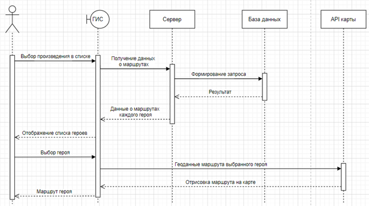 
Рис. 6 – диаграмма последовательности для прецедента «Просмотр маршрута»

На диаграмме последовательности для прецедента загрузки файла (Рис. 7) пользователь вносит свой документ на ГИС интерфейс. Сервер принимает его от клиента. Начинается процесс анализа текста. Одновременно с ним пользователя уведомляют о процессе работы над его файлом, потому что это требует время. Анализ выявляет имена в тексте, посещенные ими населенные пункты. Последнее посылается запросом к API OpenStreetMap, который возвращает координаты этих мест. В итоге полученные данные загружаются в базу данных, и пользователю приходит уведомление о результате работы.

 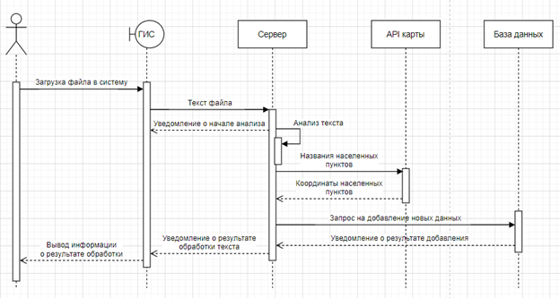 
Рис. 7 – диаграмма последовательности для прецедента «Загрузка файла»

После построения диаграмм последовательности можно приступать к проектированию внутренних систем.

#### 3.4.	Интерфейс
Правильно спроектированный интерфейс должен быть интуитивно понятен в использовании и приятен глазу ради достижения основных целей приложения. В помощь при проектировании часто применяют принципы построения интерфейсов: 
1.	Золотое сечение, которое считается самой комфортной для глаз пропорцией;
2.	Кошелек Миллера – группировка элементов в программе в количестве не более семи;
3.	Группировка – элементы разбиты по блокам по определенному признаку;
4.	Бритва Оккама и KISS (Keep It Simple Stupid) – действия по программе должны быть в минимальном количестве и очевидными;
5.	Видимость отражает полезность – пользователь должен легко находить и видеть функциональные элементы, необходимые для выполнения задач и достижения целей. Отражая полезность, видимость предполагает, что элементы, которые редко нужны или используются, могут быть скрыты.
6.	Умное заимствование – использование уже существующих элементов интерфейса и повторное применение их в новых контекстах, без внесения больших изменений в их дизайн.

Выше перечисленные принципы применятся и в интерфейсе ГИС данной ВКР. Веб-приложение предназначено для работы в браузере, и, прежде чем проектировать, стоит проанализировать подобные web ГИС.

##### 3.4.1.	Анализ интерфейса картографических приложений
В качестве примеров будут выступать сайты «Яндекс Карты», Google Map, 2ГИС.
Похожие составляющие этих сайтов:
-	большую часть области окна занимает карта;
-	поисковая часть находится слева, на которой располагается краткая информация об искомом объекте, в особенности название, его адрес, логотип и небольшая реклама в случае, если это какая-либо организация;
-	инструменты для работы с картой расположены по её краю;
-	настройки, параметры, справочная информация и обратная связь расположены слева вверху или справа, появляются при нажатии иконки бургера.
Различия между ними заметны в цветовой гамме сайта и в предоставлении информации об интересуемом месте. В Google Map информация об объекте появляется на карте в виде карточки прямо на карте с краткой информацией, отзывами и действиями с ним (Рис. 8).

 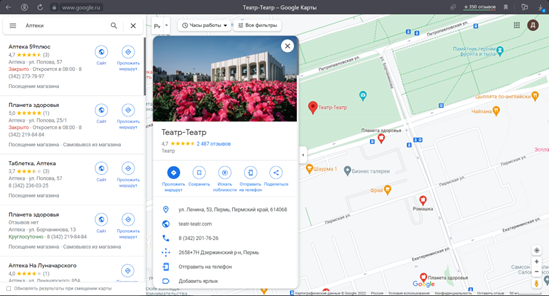 
Рис. 8 - web версия Google Map

В «Яндекс Картах» и 2ГИС (Рис. 9) данные открываются в той же панели слева, где располагаются результаты поиска, реклама или категории. Информация в ней сгруппирована.

 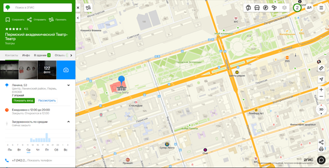 
Рис. 9 – web версия 2ГИС

На всех сайтах присутствуют фильтры (Рис. 10), разделенные на группы в соответствии с похожим смыслом.

 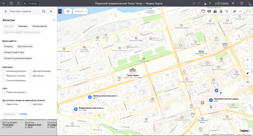 
Рис. 10 – web версия «Яндекс Карт»

Анализ web версии приложений с картами показывает, что все компании используют похожую структуру интерфейса: большую часть страницы показывает основа сайта – карта, слева – панель для манипуляции данными карты и вдоль неё есть некоторое количество инструментов, которые не привлекают к себе большого внимания. Опираясь на принципы построения интерфейсов, можно сделать вывод, что прослеживается использование принципа золотого сечения, информация и инструменты группируются по каким-то своим признакам, общему смыслу. Карта, которая является главной целью посещения сайта клиентами, содержит максимум информации об объектах и при этом не загораживается лишними инструментами и деталями. Все приложения содержат справочную информацию и предоставляют возможность двусторонней связи в случае сбоев системы. Используются распространенные иконки с понятным возложенным на них функционалом. Приложение с картами – это уже довольно обыденная вещь, испытанная многими людьми, поэтому некоторый инструментарий можно будет взять для построения интерфейса литературного картирования, применив принцип умного заимствования.

##### 3.4.2.	Проектирование интерфейса ГИС литературного картирования
На основе описанного выше технического задания, анализа похожих продуктов можно строить интерфейс приложения.
##### 3.4.2.1.	Прототипирование интерфейса
В современном веб дизайне есть множество стилей. Приложение данной курсовой работы будет построена по классике, потому что она универсальна, по ней оформлено множество качественных сайтов.
Первая страница веб-приложения будет представлять характеристику основного продукта, которое включает в себя описание приложения, закономерности его работы и имена участников проекта. По классике интерфейса сайтов логотип и меню размещены в шапке страницы, название и небольшое описание расположены наверху. Функцию перехода на карту будет производить кнопка, которая будет размещена в начале сайта и в конце для удобства пользователей. 
Вторая страница – карта. Элементов достаточно много, поэтому воспользуемся принципом «Золотого сечения»: большую часть окна оставляем для работы с картой, т.к. в приложении она больше всего будет интересовать пользователя (Рис. 11). По краям карты установлены инструменты для работы только с картой. Такой расположение элементов на сайтах применяли и те приложения, которые анализировались выше («Яндекс Карты», «2ГИС»).  Средства для работы с книгами, списки книг и героев группируем по их соответствующему для них назначению (принцип группировки). 

  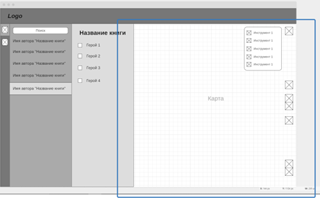 
Рис. 11 – большая часть окна составляет карта

Слева создадим небольшое навигационное меню, установив на неё иконки для работы с двумя задачами: выбор книги и маршрута и загрузка новых книг. Для облегчения поиска книги в списке появляется поисковая строка. После выбора книги появится панель с его персонажами, чтобы пользователь мог выбрать одного и нескольких для дальнейшего вывода маршрутов на экран (Рис. 12). При выборе одного из пункта навигационного меню, он выделяется другим цветом для обозначения его активности. Элементов не так много, поэтому область не загромождается (Кошелек Миллера). 
 
 
Рис. 12 – навигационное меню на сайте

Для загрузки нового текста прикрепляется не только кнопка с открытием папки на рабочем столе, но и используется технология Drag & Drop (Рис. 13).
 
 
Рис. 13 – загрузка нового текста в систему (сайт)

Форма сообщения об ошибке (Рис. 14) и справка (Рис. 15) будут открываться из меню с инструментами карты по середине страницы.
 
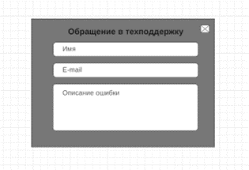 
Рис. 14 – Форма для обращения в техподдержку
 
 
Рис. 15 – справка системы
В итоге создали прототип web версии приложения с литературным картированием, которое отражает основные действия по сайту и расположение элементов на нем. 

##### 3.4.2.2.	Оформление прототипов
Расположение текста и элементов было определено. Теперь оформление. Это выбор цвета и шрифтов. 
Цвета не должны быть слишком яркими и броскими, им необходимо нести тот посыл, который соответствует идее приложения. «Геоинформационная система литературного картирования произведений русской литературы» связана с тематиками книг и карт. Цвета, которые с ними ассоциируются: бумага, дерево и зелень, соответственно, белый или бежевый, коричневый и зеленый. Это естественные краски, и они не должны вызывать отторжение у посетителей приложений. 
Выбираем именно те палитры, которые сочетаются с коричневым (Рис. 16). 

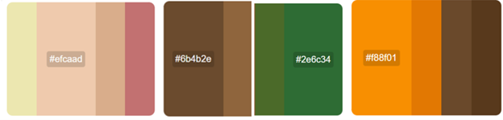
Рис. 16 – выбранные оттенки цветов

Темно коричневым будут покрываться начало главной страницы, шапка сайта, блок с участниками и всплывающие окна.
Бежевый пойдет для общего фона главной страницы и покрытие панелей, которые предназначены для работы с книгами (Рис. 17).
Зеленый и оранжевый – это более яркие цвета по сравнению с коричневым и бежевым, поэтому они будут выделять детали приложения. Зеленый – кнопки на главной странице, оранжевый – все остальные. 

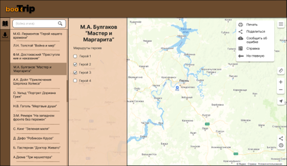
Рис. 17 – итоговый эскиз веб приложения

Чтобы сделать акцент на какой-либо форме, задний фон затемняется, но не скрывается полностью (Рис. 18). Так точно взор пользователя приложения обратится на элемент, который важен.
 
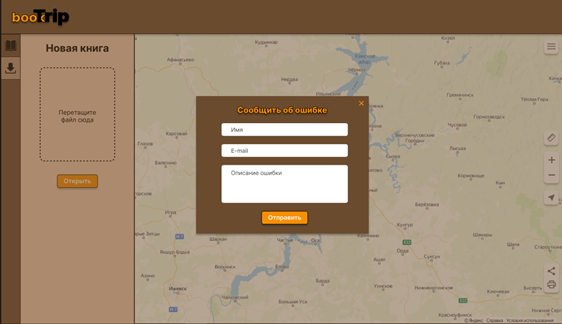
Рис. 18 – цветная форма обращения

Шрифты подбираются скромные, без излишеств, вычурности, цветовых эффектов. Выбран шрифт – Inter.
Подобрав цвета, получилось выделить рабочие области, выделить то, на чем пользователю необходимо обратить внимание. Интерфейс стал красочнее и приобрел свой стиль.

### Список используемых источников
1.	Большакова Е.И., Воронцов К.В., Ефремова Н.Э., Клышинский Э.С., Лукашевич Н.В., Сапин А.С. Автоматическая обработка текстов на естественном языке и анализ данных: учеб. пособие — М.: Изд-во НИУ ВШЭ, 2017. — 269 с
2.	Проект Natasha. Набор качественных открытых инструментов для обработки естественного русского языка (NLP). - URL: https://habr.com/ru/post/516098/ 
3.	Документация React. - URL: https://ru.react.js.org/docs/getting-started.html 
4.	HTML CSS JavaScript MySQL PHP Bootstrap book academy. - URL: https://html5css.ru/ 
5. Голованова В.С., Козьмина Е.Ю. Магистерская диссертация "Проект электронной литературной карты" // Уральский федеральный университет имени первого Президента России Б. Н. Ельцина - 2020. - c.90
6. Документация OpenStreetMap. - URL:https://wiki.openstreetmap.org/wiki/Main_Page