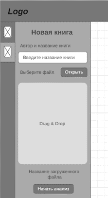
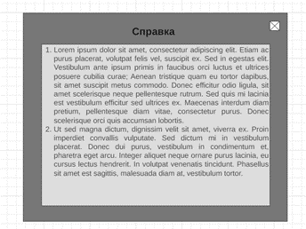
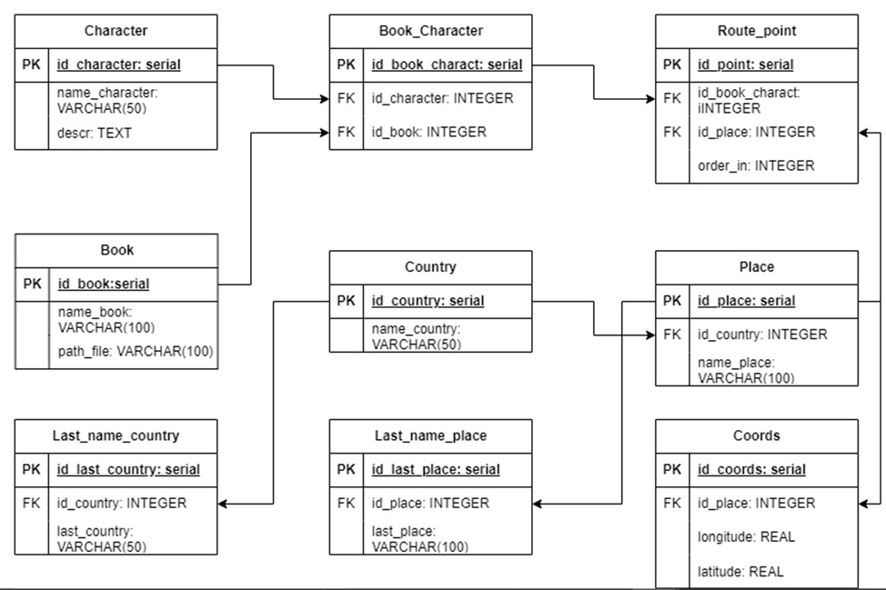

# Тема ВКР: "Геоинформационная система литературного картирования произведений русской литературы"

# Содержание

- Введение
- Методы и модели компьютерной лингвистики
- Векторизация текста
- Инструменты для анализа текста
- Анализ художественного текста
- Особенности разработки картографических приложений
- Разработка проектных решений по ГИС и её частям
- Архитектура веб-приложения
- Интерфейс
- База данных
- Алгоритм анализа произведения
- Выбор средств реализации
- Разработка ГИС
- Тестирование ГИС
- Разработка документации по ГИС и её частям
- Заключение
- Список используемой литературы

# Введение

Литературная карта произведения – это картографическое изображение модели художественного пространства, созданного автором в художественном произведении, творчески переработанное редактором или издателем, исходя из текста и замысла произведения [1]. Она может быть полезна во многих областях: 

- в образовании: играя в качестве инструмента для визуальной интерпретации произведения, литературные карты могут способствовать вовлеченности школьников и студентов в процесс изучения художественного текста и облегчению его восприятия; 
- в туризме: создание имиджа территории, на которой разворачивается сюжет книги, а также карта может выполнять функцию путеводителя; 
- в маркетинге: карта может выступать в качестве продвижения художественного издания.

Однако создание литературной карты - это процесс, требующий времени (от пары часов до нескольких дней, в зависимости от объема текста), выделенного на анализ произведения, а в последующем - на визуализацию. Создание приложения, способного автоматически построить маршрут героев книги с помощью анализа оцифрованного текста (с условием, что места, описанные в произведении, взяты с реальной карты мира), поможет ускорить и упростить этот процесс. Любой человек сможет загрузить интересующий его текст и ознакомиться с передвижениями героев произведения.

**Объектом исследования ВКР** выступает процесс анализа оцифрованного художественного произведения и визуализации полученных из него данных в формате маршрута на географической карте.

**Предметами исследования ВКР** являются модели и алгоритмы анализа художественных произведений, методы визуализации.

**Целью выпускной квалификационной работы** является автоматизация построения литературных карт художественных произведений, маршрутов героев книг с применением методов корпусной лингвистики, морфологического анализа и векторизации текста.

Для достижения поставленной цели необходимо решить следующие задачи: 
1. произвести анализ методов, моделей и инструментов компьютерной лингвистики;
2. описать требования к геоинформационной системе, разработать техническое задание на создание геоинформационной системы;
3. разработать проектные решения по геоинформационной системе и её частям;
4. разработать геоинформационную систему и провести тестирование;
5. разработать документацию на геоинформационную систему.

# 1.	Анализ предметной области
## 1.1.	Этапы компьютерной лингвистики
Литературная карта основывается на сюжете книги, действиях героев. Отсюда следует вывод, что первый шаг при построении подобных карт – это работа с текстом художественного произведения, которая базируется на вычленении информации, необходимой для визуализации её на карте. Этим помогает заниматься компьютерная лингвистика.

Компьютерная лингвистика является областью науки, которая изучает методы и технологии обработки естественного языка компьютерами и другими электронными устройствами. Ее целью является создание систем, способных понимать и генерировать естественный язык, а также анализировать и переводить тексты на различные языки. Она сочетает в себе несколько дисциплин: лингвистику, математику, информатику и искусственный интеллект. Вследствие того, что компьютерная лингвистика работает именно с естественным языком, то без знаний его общих законов, которые изучает лингвистика – структуры и функционирования, не обойтись. Состав областей этой дисциплины следующий: фонология, морфология, синтаксис, семантика и прагматика, лексикография. На основе их правил строится автоматическая обработка текстов и анализ данных. [2]

Сложность в решении задач компьютерной лингвистики заключается в том, что естественный язык, который нужно обрабатывать, характеризуется высокой степенью неоднозначности, контекстуальной зависимостью и нечеткостью, связанная с обменом информацией в процессе постоянно изменяющейся практической деятельности человека. Кроме того, задачи компьютерной лингвистики требуют использования большого объема данных и их обработки. Наконец, каждый язык имеет свои особенности, что создает трудности в создании единого алгоритма. 

В связи с вышеописанными сложностями логично разбить процесс обработки на отдельные этапы. Основных выделяют четыре:

1.	Графематический анализ, или токенизация и сегментация;
2.	Морфологический анализ;
3.	Синтаксический анализ;
4.	Семантический и прагматический анализ.

Токенизация разбивает текст на отдельные слова или токены. Простейший пример – разделение текста на слова по пробелам. Однако, на практике это довольно сложный процесс, поскольку многие языки содержат множество особенностей, таких как сложные сочетания букв, различные знаки препинания, сокращения и др. С другой стороны, сегментация разделяет текст на более крупные единицы, такие как предложения, абзацы, заголовки и т.д. Это помогает установить более широкий контекст, что оказывает существенное влияние на анализ текста. Как и в случае с токенизацией, сегментация может быть выполнена с помощью регулярных выражений или NLP библиотек. 

Что касается морфологии, то в этой части выделяют такие понятия, как морфологический анализ, который занимается получением леммы или основы заданного токена и его морфологических параметров, и морфологический синтез, являющийся обратной задачей анализа, и его целью является получение словоформы на основе определенных морфологических признаков. 

Морфологический анализ позволяет выделить корень слова, суффиксы и окончания, что в свою очередь дает возможность понимать грамматику и смысл слова в контексте. Для выполнения морфологического анализа часто применяются различные алгоритмы машинного обучения и анализа текстов. Одним из примеров применения морфологического анализа является задача определения частей речи в тексте. К примеру, в предложении «Мальчик быстро бежал вдоль озера», морфологический анализ может выделить следующие морфемы: мальчик (СУЩ), быстро (НАР), бежАть (ГЛ) -л (ПРОШ), вдоль (ПРЕДЛ), озеро (СУЩ). Одним из основных преимуществ морфологического анализа является возможность выделения различных форм слова. Например, анализ слова «бегала» может показать, что это форма глагола «бегать, прошедшее время, женский род, единственное число».

Часто при морфологическом анализе возникает проблема омонимии (особенно в русском языке), при которой одинаковые слова могут иметь различные морфологические характеристики в зависимости от контекста. Для этого проводится снятие омонимии, иначе говоря, выбирается единственный вариант морфологического значения слова.

Синтаксический анализ позволяет определить структуру предложений и выразить ее в виде дерева синтаксических зависимостей. Он основывается на синтаксических правилах, которые определяют, какие комбинации слов в предложении являются правильными, а какие нет. Синтаксические правила могут быть формализованы с помощью контекстно-свободной грамматики, что позволяет создавать компьютерные алгоритмы, которые проводят синтаксический анализ автоматически.

Семантический анализ – это процесс понимания смысла слов в контексте. Семантический анализ используется для извлечения информации и автоматического решения различных задач. Например, семантический анализ может использоваться для автоматического поиска ответов на вопросы пользователей, когда необходимо понять, что именно они хотят найти.

Прагматический анализ – это анализ текста, основанный на контексте и целях коммуникации. Прагматический анализ используется для понимания намерений говорящего и того, что он хочет донести до слушателя. Например, при анализе электронной почты прагматический анализ может помочь определить, является ли письмо вежливым или агрессивным, и как отвечать на него. 

Для разработки лингвистических процессоров используют лингвистическую информацию о естественном языке, которая хранится в различных словарях, грамматиках, коллекциях и корпусах текстов. Чаще всего применяют корпуса, которые являются большими наборами текстовых данных, включающие в себя тексты разной тематики и языка, а также метаданные, такие как дата создания текста, автор и т. д. Одни из самых известных в России корпусов являются OpenCorpora и Национальный корпус русского языка. Извлечением и анализом данных, полученных из корпуса, занимается корпусная лингвистика. Для анализа текста ВКР будет применяться данный подход, потому что корпусный анализ позволяет выполнять подбор, разметку, анализ текста и выявление соответствий, что было описано в ранее упомянутых этапах, автоматически. 

## 1.2.	Векторизация
Другой технологией обработки текста является векторизация, которая занимается преобразованием текстовых данных в векторное представление. Это делается путем присвоения каждому слову в документе числового значения, основанного на его частоте встречаемости и контексте использования. Таким образом, текст может быть анализирован и классифицирован на основе векторного представления. 

Векторизация имеет следующие часто применяемые на практике методы:

1.	Мешок слов (Bag of Words) состоит в том, чтобы сначала разбить текст на отдельные слова (токены), а затем создать вектор, который отражает, сколько раз каждое слово встречается в тексте;
2.	TF-IDF (Term Frequency-Inverse Document Frequency) используется для определения важности терминов в документе с помощью численной оценки, основанной на их частоте в документе и количестве документов, в которых они встречаются;
3.	Word2Vec использует глубокое обучение и методы, основанные на нейронных сетях, для преобразования слов в соответствующие векторы таким образом, что семантически похожие векторы находятся близко друг к другу в N-мерном пространстве, где N относится к размерам вектора;
4.	Doc2Vec создает векторное представление для целого документа, а не только для отдельных слов. Это делается путем обучения модели на большом количестве документов и создания вектора, который представляет каждый документ;
5.	GloVe использует глобальную информацию о словах, чтобы создать векторное представление. Этот метод учитывает, какие слова наиболее часто встречаются рядом и какие слова редко встречаются вместе.

В произведениях очень часто к одному персонажу обращаются по-разному. К примеру, полное имя главной героини романа «Война и мир» - Наталья Ильинична Ростова. В семье её зовут Наташей или Натали. В этом случае необходимо понять, что речь в тексте идет об одном и том же человеке. Для этого нужен контекст, то есть слова, которые чаще всего встречаются рядом с упоминанием имени этого персонажа. Тут вступает в работу векторизация, а именно по описанию вышеупомянутых методов подходит Word2Vec.

## 1.3.	Инструменты для анализа текста
В качестве языка программирования для написания алгоритма анализа текста выбран Python, так как он предоставляет доступ к большому числу бесплатных библиотек, в особенности таким, как pymorphy2, natasha, nltk, gensim. 

PyMorphy2 – это библиотека для морфологического анализа текста на естественном языке для русского языка. Она позволяет производить морфологический анализ русских слов, приводить слова в нужную форму, определять их род, число, падеж и другие грамматические категории. Pymorphy2 использует корпус русского языка OpenCorpora в качестве основного источника знаний о русском языке для своих алгоритмов морфологического анализа.

Библиотека Natasha решает базовые задачи обработки естественного русского языка: сегментация на токены и предложения, анализ морфологии и синтаксиса, лемматизация, NER (распознавание именованных сущностей)[3]. Она использует PyMorphy2. Эти библиотеки позволят получить все имена и названия стран и городов из текста, и выявить синтаксические связи между словами в предложениях.

Как говорилось раньше, текст часто бывает неоднозначен. Нет пока такой библиотеки, которая показывает идеальный результат при анализе. Поэтому при разработке алгоритмов используют несколько библиотек, использующие собственные алгоритмы, которые годны при решении каких-то определенных задач. Вследствие этого в алгоритме анализа текста ВКР в качестве второй библиотеки, занимающейся обработкой естественного языка, выступает Natural Language Toolkit (nltk), из которой в особенности будут применяться функции токенизации и список русских стоп-слов, необходимые для подготовки текста к векторизации.

Библиотека gensim используется для тематического моделирования без учителя, специализируется на извлечении семантической информации из больших текстовых корпусов. Позволяет создать модель Word2Vec, который был выбран ранее для векторизации текста.

На основе этих библиотек будет разрабатываться алгоритм анализа текста на выявление в нем персонажей и городов, которые они посетили на протяжении всего произведения.

## 1.4.	Анализ художественного текста 
Целью данной работы является автоматизация построения маршрутов героев книги, что означает необходимость поиска в тексте именованных сущностей таких как, имен людей и названий населенных пунктов, а также выявления между ними связей, что в итоге позволит построить маршрут. 

В задаче выявления имен и городов поможет корпусная лингвистика, упомянутая ранее. Работающий с морфологическим словарем OpenCorpora, PyMorphy2 осуществляет морфологический анализ, позволяющий выявить слова, которые могут иметь определенную вероятность быть или именем человека, или географическим названием. Здесь уже появляется проблема морфологической омонимии. К примеру, слово «Лена» может быть как именем девушки, так и названием реки. Возникает необходимость в контексте.  Решением этой проблемы помогает заниматься библиотека Natasha, которая специально имеет функции для определения именованных сущностей, основанные на методах обработки текстов компьютерной лингвистики, включая глубокое обучение. Удобна данная библиотека и тем, что названия, которые состоят из нескольких слов, она выводит как одно («Наташа Ростова», а не «Наташа» и «Ростова»). 

Связанные по смыслу и грамматически слова являются словосочетанием, соединенные на основе синтаксической связи, в которой одно слово является главным, другое – зависимым: работать (как?) усердно, банка (какая?) стеклянная. Группа словосочетаний образуют логически верное предложение (Рисунок 1).

 
 
Рисунок 1 – синтаксический разбор предложения

Следовательно, чтобы найти связь между героем и местом, которое он посещает, необходимо произвести синтаксический разбор предложения.

Маршрут – это движение от одной точки к другой. Поэтому связью между именем и городом будут глаголы, обозначающие перемещение, к примеру: приехать, возвратиться, идти, улететь и т.д., или существительные: возвращение, приезд. В этом случае необходимо установить именно факт выполнения этих действий. Предложения «В конце письма она извещала его, что на днях приедет в Петербург из-за границы.», «– Вы поезжайте в Петербург; это лучше.» говорят о будущих планах, намерениях, поэтому глаголы должны быть в прошедшем времени или настоящем, обозначающие, что герой точно посетил этот населенный пункт.

Библиотека Natasha помогает выполнять также синтаксический анализ текста, присваивая словам предложения id, head_id (связь с другим словом в предложении) и rel – часть речи в аннотации Universal Dependencies [4], что позволит выявить связь между словами (Рисунок 2). 

 
 
Рисунок 2 – синтаксический разбор предложения библиотекой Natasha

Из примера на рисунке 2 видно, что слово «Андрей» связано с глаголом «вернулся», также как и «Москва». Просмотрев разбор библиотекой Natasha других предложений в текстах, можно выявить закономерность, при которой связанные имена героев и посещаемые ими города можно вывезти из текста. К примеру группа словосочетаний в предложении на рисунке 2: [advcl - > nsubj & advcl - > obl & obl -> case]. Если слово с частью речи advcl есть в предложении, то проверяются части речи nsubj и obl, а дальше и case. Получив положительный результат, можно выбрать имя и город из предложения и записать их в маршрут. 

Но Natasha не всегда выдает точные результаты, поэтому требуются дополнительные проверки. 

PyMorphy2 поможет для проверки полученных из Natasha слов на имена, фамилии и отчества, а также приведению их в нужный падеж, число и род. 

Функция WordPunctTokenizer из библиотеки nltk необходима в случаях, когда Natasha не справилась с токенизацией слов в предложении, что может служить к неправильной интерпретации слов библиотекой и анализатором. 

Проверка стран и городов будет осуществляться с помощью созданного вручную набора из их названий. Причиной выбора такого способа является то, что в создаваемую систему могут поступать тексты, описывающие разные периоды истории мира, в которых страны и города ещё имели совсем другие названия, а для отрисовки данных на карте необходимы современные данные. Готовых наборов данных в интернете нет, поэтому страны и города прописываются вручную вместе с их устаревшими названиями.

В итоге всех манипуляций с получением имен, местоположений, проверками, составляется маршрут из списка выявленных городов, привязанные к одному персонажу.

## 1.5.	Особенности разработки картографических приложений
Второй шаг в создании литературной карты – её визуализация. Приложения, направленные на работу с картами, называют геоинформационными системами.

Геоинформационная система (ГИС) – это информационная система, предназначенная для сбора, хранения, проверки и отображения информации, связанной с местоположениями на поверхности Земли. Она предоставляет возможность привязывать карты к информации, позволяя её визуализировать и выявлять закономерности и взаимосвязи. Полноценная ГИС обладает такими компонентами, как техническое, программное и информационное обеспечения. [5]

Техническое обеспечение состоит из аппаратных средств, таких как компьютеры, серверы, хранилища данных и другое оборудование, которое необходимо для обработки и хранения геоданных. 

Программное обеспечение включает в себя различные компоненты, такие как операционные системы, СУБД, ядра ГИС и другие программы, которые обеспечивают обработку и анализ данных.

Информационное обеспечение предоставляет доступ к геоданным, которые используются в ГИС, а также включает в себя процессы управления геоданными, такие как управление качеством данных, стандартизация, обработка и конвертация форматов данных, для обеспечения их совместимости с системой ГИС. 

Взаимодействие трех вышеупомянутых компонентов позволяет создавать собственную картографическую среду, специально разрабатываемую для работы с географическими данными, что позволяет разработчикам создавать более точные карты и модели, которые могут быть настроены и адаптированы под конкретные задачи. Но выполнение такой системы довольно долгий и сложный процесс. В рамках же данной ВКР требуется лишь наличие размеченной карты с координатами с возможностью отрисовки на ней маршрутов. В этом случае на помощь приходят картографические сервисы, которые могут быть интегрированы в веб-приложение с помощью API, и позволяют получить все нужные геоданные для текущей работы. К примеру, OpenStreetMap, Yandex Map, Google Maps. 

Для выполнения ВКР выбран OpenStreetMap в связи её доступности. Он предоставляет открытую базу данных расположения объектов, включая дороги, здания, мосты и многие другие элементы, что обеспечивает возможность создавать интерактивные карты, основанные на реальных данных. OpenStreetMap предоставляет документацию со всеми её компонентами, которые помогают в разработке приложений с картами (Рис. 3) [6].
 
 

Рисунок 3 – компоненты OpenStreetMap

Из рисунка 3 можно увидеть компоненты, хранящие геоданные, которые можно подключать к своей базе данных PostgreSQL, но в создании ГИС литературного картирования достаточно работать через его API Leaflet.

ГИС данной ВКР будет направлена на литературное картирование. Географическими данными будут выступать места, в которых побывали герои художественного произведения, которые получены в итоге анализа текста.

## 1.6.	Вывод к разделу
В ходе анализа предметной области выявлено следующее:
- проведен анализ этапов обработки текста на естественном языка;
- рассмотрены методы векторизации текста, для дальнейшей работы выбран Word2Vec, более подходящий для выявления имен одного человека в тексте;
- выбраны инструменты для разработки алгоритма анализа текста;
- прописана логика работы с вычленением информации из текста;
- было принято решение создания геоинформационной системы на основе картографических сервисов, что позволит ускорить процесс разработки и достижения поставленной ВКР цели.

# 2. Разработка проектных решений по ГИС и её частям

Проектирование ГИС перед разработкой веб-приложения является критически важным шагом. Правильное выполнение этого этапа позволяет создать более эффективное и масштабируемое веб-приложение, которое легче поддерживать и сопровождать в долгосрочной перспективе. Проектирование системы дает возможность разработчику и заказчику получить визуальное представление о проекте и отделить имеющиеся идеи от тех, которых нет. Проитерировав и определив ключевые требования приложения, можно шаг за шагом представить концепцию будущего веб-приложения и уточнить решения по его разработке.

# 2.1. Архитектура веб-приложения

ГИС литературного картирования имеет клиент-серверную архитектуру. Такую архитектуру часто используют для построения веб-приложений. И не без причины. У неё есть ряд преимуществ: 

1. Клиент-серверная архитектура обеспечивает более эффективную обработку запросов и расчетов. Она позволяет распределить нагрузку между клиентским и серверным оборудованием, что повышает их производительность.

2. Централизованный контроль является ключевым преимуществом клиент-серверной архитектуры. Сервер предоставляет централизованный доступ к всем ресурсам, что позволяет эффективно управлять ресурсами приложения и обеспечивает более безопасную обработку данных.

3. Клиент-серверная архитектура обеспечивает более удобный и простой доступ к ресурсам приложения. Она позволяет пользователям получать доступ к приложению из любого места в мире через интернет. Это позволяет пользователю быстро и легко получить необходимую информацию.

Подробнее рассмотрим архитектуру, на основе которой будет строиться ГИС литературного картирования произведений русской литературы (Рис. 4).
 
  

Рисунок 4 – клиент-серверная архитектура ГИС

Система многоуровневая. Каждый слой выполняет определенную функцию. 
Клиентом выступает браузер. Когда пользователь вводит URL-адрес, он отправляет запрос на сервер для получения нужной страницы. Браузер получает ответ от сервера и выводит его на экране. Положительным ответом будет являться интерфейс (GUI), который отображает всю информацию и обеспечивает взаимодействие с пользователем (карта и меню с выбором произведений и персонажей и с загрузкой текста). 

Сервер выполняет функцию обработки запросов клиента, хранения и обновления данных, а также передачи их на клиентскую сторону. Функция выполнения бизнес-логики на сервере обеспечивание обработку данных, а точнее анализ загруженного пользователем текста и сохранение полученных результатов в базе данных.

Клиент и сервер взаимодействуют друг с другом с помощью протоколов и сетевых соединений. При работе веб-приложения запросы и ответы осуществляются путем их передачи в сети с использованием протокола HTTP. Протокол HTTP устанавливает набор правил и процедур, которые используются веб-клиентами и веб-серверами для обмена сообщениями друг с другом (запросы и ответы).

База данных хранит данные, которые получились в результате работы анализа алгоритма, выполняющегося на сервере. 

# 2.2. Выбор средств реализации приложения

Основой любой ГИС является карта. Работа ВКР построена вокруг OpenStreetMap. Для разработки взяты его компоненты Nominatim и Leaflet. Nominatim предназначен для осуществления поиска географических объектов по их имени и адресу. С помощью него получаем координаты полученных из анализа произведения населенных пунктов, а Leaflet отображает эти координаты, соединяя их в линии, представляющие маршруты героев произведения, на карте OpenStreetMap.

Формирование интерфейса и взаимодействие с картой выполняет React. Это библиотека JavaScript, которая позволяет обновлять элементы на странице без её перезагрузки при том, что встроенный алгоритм согласования отслеживает, какие части приложения изменились и обновить только их, а не полностью все приложение. 

React Leaflet обеспечивает привязки между React и Leaflet. Она не заменяет Leaflet, но использует ее для абстрактных слоев Leaflet в качестве компонентов React.

CSS – язык каскадных стилей, который используется для описания внешнего вида страницы. С помощью CSS можно задавать различные стили для разных элементов HTML, таких как цвет, фон, шрифт, выравнивание и многое другое. В случае React используется не HTML, а помесь между HTML и JavaScript, называемым JSX.

Flask — это микро-фреймворк для создания веб-приложений на Python. Расширения для микро-фреймворка позволяют коммуницировать с базами данных, проверять формы, контролировать загрузку на сервер, работать с аутентификацией и многое другое. Flask использует одну из самых передовых служебных библиотек WSGI (Web Server Gateway Interface), используется для пересылки запросов с веб-сервера (такого как Apache или Nginx) на серверное веб-приложение или фреймворк Python. Затем ответы передаются обратно на веб-сервер для ответа отправителю запроса (Рис. 5).

 

Рисунок 5 – работа WSGI

Контейнер WSGI – это в целом отдельный запущенный процесс, который выполняется на другом порту, чем веб-сервер, и веб-сервер настроен на передачу запросов в контейнер WSGI, который запускает веб-приложение, а затем передает ответ (в виде HTML) обратно отправителю запроса в браузере.

В ГИС данной ВКР с помощью Flask осуществляем взаимодействие веб-приложения с базой данных и анализ загруженного текста в систему.

Nginx, упомянутый на рис. 5, выступает в качестве веб-сервера, который используется для обработки запросов пользователей и управления их распределением между различными серверами веб-приложений. Вместо создания новых процессов для каждого веб-запроса, Nginx использует асинхронный, управляемый событиями подход. В этом случае запросы обрабатываются в одном потоке. Более того, один главный процесс может управлять различными рабочими процессами в нем.

Для хранения данных используется PostgreSQL (Postgres) – объектно-реляционная система управления базами данных (СУБД), которая используется для организации хранения и управления большими объемами структурированных данных. PostgreSQL предоставляет расширенные функциональные возможности, включая поддержку индексов, транзакций, хранимых процедур и триггеров, а также обработку данных географических информационных систем (ГИС).

В итоге из всех вышеперечисленных инструментов строится ГИС литературного картирования произведений русской литературы.

# 2.3. Диаграммы последовательности

Диаграммы последовательности помогают документировать и понимать динамические аспекты программной системы - в частности, последовательность сообщений, которые отправляются и принимаются между объектами. На рис. 6 изображена диаграмма последовательности для прецедента просмотра маршрутов. На ней описано следующее: 

Чтобы получить данные конкретного персонажа, пользователь, обращаясь к интерфейсу ГИС, производит запрос выбора книги из списка. Сервер обрабатывает этот запрос и формирует другой, уже к базе данных, на получение информации о героях и об их маршрутах выбранного произведения, получает из неё ответ. Эти данные сервер передает ГИС интерфейсу, который выдает перечень имен. Конечным действием для пользователя остается выбрать героя, что впоследствии с помощью полученных ранее данных этого персонажа формируется запрос к API OpenStreetMap, который в конечном итоге выдает маршрут.

  
Рисунок 6 – диаграмма последовательности для прецедента «Просмотр маршрута»

На диаграмме последовательности для прецедента загрузки файла (Рис. 7) пользователь вносит свой документ на ГИС интерфейс. Сервер принимает его от клиента. Начинается процесс анализа текста. Одновременно с ним пользователя уведомляют о процессе работы над его файлом, потому что это требует время. Анализ выявляет имена в тексте, посещенные ими населенные пункты. Последнее посылается запросом к API OpenStreetMap, который возвращает координаты этих мест. В итоге полученные данные загружаются в базу данных, и пользователю приходит уведомление о результате работы.

  
Рисунок 7 – диаграмма последовательности для прецедента «Загрузка файла»

После построения диаграмм последовательности можно приступать к проектированию внутренних систем.

# 2.4. Интерфейс

// требования к интерфейсам даются в HIG - https://yandex.ru/search/?text=hig

Правильно спроектированный интерфейс должен быть интуитивно понятен в использовании и приятен глазу ради достижения основных целей приложения. В помощь при проектировании часто применяют принципы построения интерфейсов: 

1. Золотое сечение, которое считается самой комфортной для глаз пропорцией;
2. Кошелек Миллера – группировка элементов в программе в количестве не более семи;
3. Группировка – элементы разбиты по блокам по определенному признаку;
4. Бритва Оккама и KISS (Keep It Simple Stupid) – действия по программе должны быть в минимальном количестве и очевидными;
5. Видимость отражает полезность – пользователь должен легко находить и видеть функциональные элементы, необходимые для выполнения задач и достижения целей. Отражая полезность, видимость предполагает, что элементы, которые редко нужны или используются, могут быть скрыты.
6. Умное заимствование – использование уже существующих элементов интерфейса и повторное применение их в новых контекстах, без внесения больших изменений в их дизайн.

Выше перечисленные принципы применятся и в интерфейсе ГИС данной ВКР. Веб-приложение предназначено для работы в браузере, и, прежде чем проектировать, стоит проанализировать подобные web ГИС.

## 2.4.1. Анализ интерфейса картографических приложений

В качестве примеров будут выступать сайты «Яндекс Карты», Google Map, 2ГИС.
Похожие составляющие этих сайтов:
- большую часть области окна занимает карта;
- поисковая часть находится слева, на которой располагается краткая информация об искомом объекте, в особенности название, его адрес, логотип и небольшая реклама в случае, если это какая-либо организация;
- инструменты для работы с картой расположены по её краю;
- настройки, параметры, справочная информация и обратная связь расположены слева вверху или справа, появляются при нажатии иконки бургера.

Различия между ними заметны в цветовой гамме сайта и в предоставлении информации об интересуемом месте. В Google Map информация об объекте появляется на карте в виде карточки прямо на карте с краткой информацией, отзывами и действиями с ним (Рис. 8).

  
Рисунок 8 - web версия Google Map

В «Яндекс Картах» и 2ГИС (Рис. 9) данные открываются в той же панели слева, где располагаются результаты поиска, реклама или категории. Информация в ней сгруппирована.

  
Рисунок 9 – web версия 2ГИС

На всех сайтах присутствуют фильтры (Рис. 10), разделенные на группы в соответствии с похожим смыслом.

  
Рисунок 10 – web версия «Яндекс Карт»

Анализ web версии приложений с картами показывает, что все компании используют похожую структуру интерфейса: большую часть страницы показывает основа сайта – карта, слева – панель для манипуляции данными карты и вдоль неё есть некоторое количество инструментов, которые не привлекают к себе большого внимания. Опираясь на принципы построения интерфейсов, можно сделать вывод, что прослеживается использование принципа золотого сечения, информация и инструменты группируются по каким-то своим признакам, общему смыслу. Карта, которая является главной целью посещения сайта клиентами, содержит максимум информации об объектах и при этом не загораживается лишними инструментами и деталями. Все приложения содержат справочную информацию и предоставляют возможность двусторонней связи в случае сбоев системы. Используются распространенные иконки с понятным возложенным на них функционалом. Приложение с картами – это уже довольно обыденная вещь, испытанная многими людьми, поэтому некоторый инструментарий можно будет взять для построения интерфейса литературного картирования, применив принцип умного заимствования.

## 2.4.2. Проектирование интерфейса ГИС литературного картирования

На основе описанного выше технического задания, анализа похожих продуктов можно строить интерфейс приложения.

## 2.4.2.1. Прототипирование интерфейса

В современном веб дизайне есть множество стилей. Приложение данной курсовой работы будет построена по классике, потому что она универсальна, по ней оформлено множество качественных сайтов.

Первая страница веб-приложения будет представлять характеристику основного продукта, которое включает в себя описание приложения, закономерности его работы и имена участников проекта. По классике интерфейса сайтов логотип и меню размещены в шапке страницы, название и небольшое описание расположены наверху. Функцию перехода на карту будет производить кнопка, которая будет размещена в начале сайта и в конце для удобства пользователей. 

Вторая страница – карта. Элементов достаточно много, поэтому воспользуемся принципом «Золотого сечения»: большую часть окна оставляем для работы с картой, т.к. в приложении она больше всего будет интересовать пользователя (Рис. 11). По краям карты установлены инструменты для работы только с картой. Такой расположение элементов на сайтах применяли и те приложения, которые анализировались выше («Яндекс Карты», «2ГИС»).  Средства для работы с книгами, списки книг и героев группируем по их соответствующему для них назначению (принцип группировки). 

   

Рисунок 11 – большая часть окна составляет карта

Слева создадим небольшое навигационное меню, установив на неё иконки для работы с двумя задачами: выбор книги и маршрута и загрузка новых книг. Для облегчения поиска книги в списке появляется поисковая строка. После выбора книги появится панель с его персонажами, чтобы пользователь мог выбрать одного и нескольких для дальнейшего вывода маршрутов на экран (Рис. 12). При выборе одного из пункта навигационного меню, он выделяется другим цветом для обозначения его активности. Элементов не так много, поэтому область не загромождается (Кошелек Миллера). 
 
 

Рисунок 12 – навигационное меню на сайте

Для загрузки нового текста прикрепляется не только кнопка с открытием папки на рабочем столе, но и используется технология Drag & Drop (Рис. 13).
 
 

Рисунок 13 – загрузка нового текста в систему (сайт)

Форма сообщения об ошибке (Рис. 14) и справка (Рис. 15) будут открываться из меню с инструментами карты по середине страницы.
 
 

Рисунок 14 – Форма для обращения в техподдержку
 
 

Рисунок 15 – справка системы

В итоге создали прототип web версии приложения с литературным картированием, которое отражает основные действия по сайту и расположение элементов на нем. 

## 2.4.2.2. Оформление прототипов

Расположение текста и элементов было определено. Теперь оформление. Это выбор цвета и шрифтов. 

Цвета не должны быть слишком яркими и броскими, им необходимо нести тот посыл, который соответствует идее приложения. «Геоинформационная система литературного картирования произведений русской литературы» связана с тематиками книг и карт. Цвета, которые с ними ассоциируются: бумага, дерево и зелень, соответственно, белый или бежевый, коричневый и зеленый. Это естественные краски, и они не должны вызывать отторжение у посетителей приложений. 

Выбираем именно те палитры, которые сочетаются с коричневым (Рис. 16). 

Рисунок 16 – выбранные оттенки цветов

Темно коричневым будут покрываться начало главной страницы, шапка сайта, блок с участниками и всплывающие окна.

Бежевый пойдет для общего фона главной страницы и покрытие панелей, которые предназначены для работы с книгами (Рис. 17).

Зеленый и оранжевый – это более яркие цвета по сравнению с коричневым и бежевым, поэтому они будут выделять детали приложения. Зеленый – кнопки на главной странице, оранжевый – все остальные. 

Рисунок 17 – итоговый эскиз веб приложения

Чтобы сделать акцент на какой-либо форме, задний фон затемняется, но не скрывается полностью (Рис. 18). Так точно взор пользователя приложения обратится на элемент, который важен.
 

Рисунок 18 – цветная форма обращения

Шрифты подбираются скромные, без излишеств, вычурности, цветовых эффектов. Выбран шрифт – Inter.

Подобрав цвета, получилось выделить рабочие области, выделить то, на чем пользователю необходимо обратить внимание. Интерфейс стал красочнее и приобрел свой стиль.

# 2.5. Проектирование базы данных
Проектирование базы данных включает в себя создание концептуальной, логической и физической моделей. 

Концептуальная модель отражает предметную область и информационную потребность пользователей. Она определяет значения данных по отношению к другим данным.
Логическая модель данных уже не является абстрактной, как концептуальная, а предоставляет более подробную информацию о понятиях и отношениях в соответствующей области. Логическая модель данных не определяет технические требования к системе.
Последним шагом в проектировании базы данных является построение физической модели базы данных. Основная цель этого шага - описать, как физически реализовать логический проект базы данных. Здесь подробно описывается схема данных с указанием всех типов, полей, размеров и ограничений.

## 2.5.1.	Концептуальная модель
Данные в приложении необходимы для работы алгоритма системы, отвечающий за анализ загружаемого в него произведения, а также отображения его работы пользователю. Следуя из этого, концептуальная модель будет содержать следующие сущности:
1.	«Книга» - список загруженных и обработанных системой книг;
2.	«Персонаж» - имена героев и их краткое описание, полученные из анализа текста загруженных произведений;
3.	«Страна» - содержит актуальные на момент написания ВКР названия стран;
4.	«Прошлое название страны» - названия стран в прошлом. Произведения, загружаемые в систему, могут вести свое повествование о разных временах всемирной истории, поэтому эта сущность нужна для того, чтобы процессу анализа текста дать понять, что речь идет об одной и той же стране;
5.	«Место» - содержит актуальные на момент написания ВКР названия населенных пунктов;
6.	«Прошлое название места» - названия населенных пунктов в прошлом;
7.	«Координаты» - географические данные населенного пункта;
8.	«Пункт маршрута» - содержит порядок посещения героем места в его маршруте.

В концептуальной модели формируем из выявленных сущностей связи:
1.	Связь «Книга» - «Персонаж»: герои берутся из книг, и в большинстве произведений рассказывается более, чем об одном персонаже, поэтому связь будет 1:М;
2.	Связь «Страна» - «Прошлое название страны»: у одной страны может быть более одного исторически сложившихся названий, связь 1:М;
3.	Связь «Место» - «Прошлое название места»: у одного населенного пункта может быть более одного варианта названия в прошлом, связь 1:М;
4.	Связь «Место» - «Координаты»: каждое место имеет свое местоположения, определяемое географическими координатами, но не более одного, связь 1:1;
5.	Связь «Страна» - «Место»: страна включает в себя много населенных пунктов, связь 1:M
6.	Связь «Персонаж» - «Пункт маршрута»: пункт маршрута – это промежуточные точки, из которых собирается маршрут героя, что означает, что герой их проходит более одного, связь 1:М;
7.	Связь «Место» - «Пункт маршрута»: место, или населенный пункт, может быть посещен много раз, связь 1:М.

На рисунке 17 представлена концептуальная модель базы данных.
 

Рисунок 17 – концептуальная модель базы данных

## 2.5.2.	Логическая модель базы данных
Логические модели данных строятся по аналогии с естественным языком. Основными компонентами логической модели являются сущности, отношения между сущностями и их свойства(атрибуты).

Сущности определены в концептуальной модели. В логической модели определяются атрибуты, сущности расписываются в виде таблиц. Определяются первичные (PK) и вторичные ключи (FK) (Рис. 18).

 
Рисунок 18 – логическая модель базы данных

На основе логической модели строится физическая модель базы данных. 

## 2.5.3.	Физическая модель базы данных
В техническом задании указано, что за управлением базой данных должен отвечать PostgreSQL. Данные в физической модели отражаются в соответствии с особенностями вышеупомянутой СУБД (Рис. 19).

 
Рисунок 19 – физическая модель базы данных

Опираясь на физическую модель базы данных, формируется база данных геоинформационной системы.

# 2.6.	Выводы по разделу
В данном разделе проектирования были рассмотрены существующие подходы к решению задач автоматизации. Спроектирована архитектура веб-приложения. Рассмотрены инструменты для разработки. На основе требований к системе разработаны диаграммы последовательности. Спроектированы концептуальная, логическая и физическая модели для базы данных, интерфейс для пользователей. 

### Список используемых источников

1. Голованова В.С., Козьмина Е.Ю. Магистерская диссертация "Проект электронной литературной карты" // Уральский федеральный университет имени первого Президента России Б. Н. Ельцина - 2020. - c.90
2. Большакова Е.И., Воронцов К.В., Ефремова Н.Э., Клышинский Э.С., Лукашевич Н.В., Сапин А.С. Автоматическая обработка текстов на естественном языке и анализ данных: учеб. пособие — М.: Изд-во НИУ ВШЭ, 2017. — 269 с.
3. Проект Natasha. Набор качественных открытых инструментов для обработки естественного русского языка (NLP). - URL: https://habr.com/ru/post/516098/ 
4. Universal Dependencies format - URL: https://universaldependencies.org/
5. А.А. Калинин, А.М. Бондаренко, Б.Н. Строгий, М.Н. Семенцов. Географические информационные системы. Курс лекций: учебное пособие – Зерноград: Азово-Черноморский инженерный институт ФГБОУ ВПО ДГАУ, 2015. – 58 с.
6. Документация OpenStreetMap. - URL: https://wiki.openstreetmap.org/wiki/RU:Обзор_компонентов_OSM

// ССылки на эти источники не найдены.

3. Документация React. - URL: https://ru.react.js.org/docs/getting-started.html 
4. HTML CSS JavaScript MySQL PHP Bootstrap book academy. - URL: https://html5css.ru/ 

# Приложение
# Техническое задание
# 1. Общие сведения
## 1.1 Полное наименование системы и её условное обозначение
«Геоинформационная система литературного картирования произведений русской литературы на примере романа Л.Н. Толстого “Война и мир”»

## 1.1 Плановые сроки начала, и окончания работы по созданию системы
Срок начала работы по созданию системы: 06.02.2023 г.
Срок окончания работы: 02.06.2023 г.

## 1.2 Сведения об источниках и порядке финансирования работ
Собственные средства разработчика

## 1.3 Порядок оформления и предъявления заказчику результатов работ по созданию системы (ее частей), по изготовлению и наладке отдельных средств (технических, программных, информационных) и программно-технических (программно-методических) комплексов системы

Результаты работ передаются заказчику частями по завершении каждой её стадии.
В качестве результатов работ разработчика выступают программный код и документация на автоматизированную систему, которые передаются заказчику в виде репозитория с кодом программы.
 
# 2. Назначение и цели создания (развития) системы

## 2.1 Назначение системы
Геоинформационная система литературного картирования произведений русской литературы предназначена для автоматизации построения маршрутов героев книги с помощью анализа оцифрованного художественного произведения

## 2.2 Цели создания системы

Основными целями создания системы являются:

- популяризация русской литературы;
- развитие интереса людей к чтению;
- формирование имиджа территорий, на которых разворачиваются сюжеты книг, что способствует культурному туризму.

# 3. Характеристика объектов автоматизации

## 3.1 Kраткие сведения об объекте автоматизации или ссылки на документы, содержащие такую информацию

Объектами автоматизации выступает процесс анализа оцифрованного художественного произведения и визуализация полученных из него данных в виде маршрута на географической карте.

-- *Изменено* --
Процесс анализа оцифрованного художественного произведения включает в себя загрузку пользователем файла в форматах .txt, .docx или .pdf, после которой начинается работа алгоритма, включающая поиск в загруженном тексте имен персонажей, городов и связь между ними. Полученные данные загружаются в базу данных. Название произведения появляется в списке книг. Чтобы увидеть результат работы алгоритма, пользователь должен выбрать загруженное в систему произведение в списке. База данных выдаст имена персонажей этой книги. При выборе одного из них на карте появятся маркеры, закрепленные за населенными пунктами, и линии между ними, в общем виде представляющие маршрут, проделанный героем в течении всего произведения.

# 4. Требования к системе

## 4.1. Требования к системе в целом

Система должна удовлетворять следующим требованиям:

- исполнение всех функций, оговоренных настоящим документом в пункте 4.2;
- исполнение требований к веб-приложению, оговоренных настоящим документов в пунктах 4.1.1., 4.1.2., 4.1.3., 4.1.4., 4.1.5., 4.1.6., 4.1.7., 4.1.8., 4.1.9., 4.1.10., 4.1.11., 4.1.12., 4.1.13.

### 4.1.1. Требования к структуре и функционированию системы

Клиент-серверная архитектура. На клиенте должен быть организован интерфейс, с помощью которого пользователь будет взаимодействовать с приложением. Сервер должен обрабатывать запросы пользователя, проводить анализ загруженных текстов в систему, взаимодействовать с базой данных. База данных должна содержать данные, которые получились в результате работы алгоритма на сервере.

### 4.1.2. Требования к численности и квалификации персонала системы и режиму его работы

Требования не предъявляются

### 4.1.3. Показатели назначения

### 4.1.3.1. Степень приспособляемости системы к изменению процессов и методов управления, к отклонениям параметров объекта управления

Система не должна препятствовать появлению новых или изменению текущих процессов и методов управления.

### 4.1.3.2. Допустимые пределы модернизации и развития системы

Модернизация и развитие системы прекращается в случае, когда экономические затраты на их внедрение превышают затраты, вложенные на указанные цели.

### 4.1.4. Требования к надежности

-- *Изменено* --
Геоинформационная система должна выполнять требуемые функции и быть пригодной для эксплуатации. Веб-приложение должно быть стабильно, другими словами оно должно быть способно правильно выполнять запланированные операции, даже при наличии случайных отклонений.

### 4.1.5. Требования безопасности

Не предъявляются

### 4.1.6. Требования к эргономике и технической эстетике

Веб-приложение должно быть оснащено графическим интерфейсом для обеспечения связи между ним и пользователем, которое позволит достигать поставленных веб-приложением целей.

### 4.1.7. Требования к транспортабельности для подвижных АС

Требования не предъявляются

### 4.1.8. Требования к эксплуатации, техническому обслуживанию, ремонту и хранению компонентов системы

Требования не предъявляются

### 4.1.9. Требования к защите информации от несанкционированного доступа

Требования не предъявляются

### 4.1.10. Требования по сохранности информации при авариях требования к защите от влияния внешних воздействии

Требования не предъявляются 

### 4.1.11. Требования к патентной чистоте

Требования к патентной частоте должны быть соблюдены системой согласно действующему законодательству Российской Федерации.

### 4.1.12. Требования по стандартизации и унификации

Требования по стандартизации и унификации не требуются

### 4.1.13. Дополнительные требования

Дополнительные требования не предъявляются

### 4.2. Требования к функциям(задачам), выполняемым системой

Веб-приложение должно предоставлять следующие возможности:

1. Выбор из списка литературы одного произведения
2. Выбор героев из книги, маршрут которых пользователю хотелось бы увидеть на карте
3. Загрузка своего произведения в систему из компьютера. 
Разрешенные форматы загружаемых в систему файлов: .txt, .pdf

4. Взаимодействие с картой:

- изменение масштаба,
- измерение расстояния маршрута,
- поиск расположения пользователя на карте,
- печать карты.

## 4.3. Требования к видам обеспечения

### 4.3.1. Требования к математическому обеспечению системы

Обработка произведений должна осуществляться с помощью морфологического анализа с применением методов корпусной лингвистики и векторизации текста.

### 4.3.2. Требования к информационному обеспечению

-- *Изменено* --
Файлы с текстами произведений должны загружаться в файловую систему приложения.
Хранение данных, используемых при анализе загруженного произведения и полученных из него, должно осуществляться c помощью СУБД.
В качестве СУБД используется PostgreSQL.

### 4.3.3. Требования к лингвистическому обеспечению

Система будет использовать русский язык для взаимодействия с пользователем.
При разработке системы должны использоваться следующие языки:
- HTML, CSS – frontend часть веб-приложения
- Python, JavaScript, React – frontend и backend части веб-приложения
- SQL – взаимодействие с данными 

### 4.3.4. Требования к программному обеспечению

Система должна поддерживаться во всех современных браузерах кроме тех, в которых отсутствует поддержка ES5-методов или микротасков, например Internet Explorer, потому что в данной системе будет использоваться React.

### 4.3.5. Требования к техническому обеспечению

Техническое обеспечение системы должно максимально и наиболее эффективным образом использовать существующие технические средства.

### 4.3.6. Требования к метрологическому обеспечению

-- *Изменено* -- 
Функция измерения расстояния маршрута должна выдавать результат в километрах.
Коодинаты населенных пунктов в базе данных хранятся в градусах в виде десятичной дроби.
Работа с картой OpenStreetMap. Слой должен использоваться стандартный.

### 4.3.7. Требования к организационному обеспечению

Требования не предъявляются

# 5. Состав и содержание работ по созданию системы

|Наименование этапа |Дата выполнения|
|-------------------|---------------|
|Обследование (сбор и анализ данных) автоматизируемого объекта, включая сбор сведений о зарубежных и отечественных аналогах |28.02.23|
|Проектирование  ГИС|21.03.23|
|Разработка теоретической части; Выбор и разработка средств решения задачи |02.05.23|
|Разработка документации к программному продукту |16.05.23|
|Представление работы на проверку и отзыв руководителя квалификационной работы | 19.05.23|

# 6. Порядок контроля и приемки системы

## 6.1. Виды, состав, объем и методы испытаний системы и ее составных частей

Испытание системы проводится с помощью функционального тестирования

## 6.2. Общие требования к приемке работ по стадиям (перечень участвующих предприятий и организаций, место и сроки проведения), порядок согласования и утверждения приемочной документации

Сдача-приемка работ осуществляется по предъявлении разработчиком отчетов по ВКР и других сопроводительных комплектов документов. 

# 7. Требования к документированию
В пакет документации 

# 8. Источники разработки

Источниками разработки настоящего технического задания выступают:
- ГОСТ 34.602-89;
- Курушин Д.С., Гребенщикова Е.В., Орлова Е.Д., Фоминых П.Ю. «Анализ текста: составление карты литературного произведения» // ПНИПУ – 2020. – 7с.

---